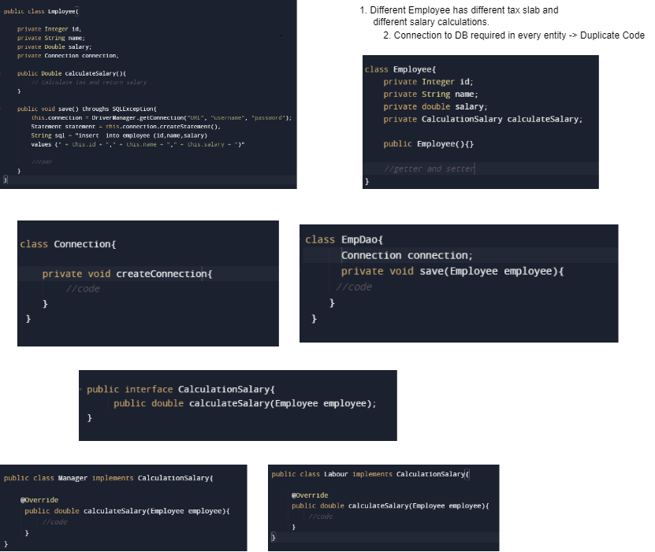

## __S.O.L.I.D Principles__

### 1. __Single Responsibilty Principle__
```
It states that a class or a module should have only one reason to change, meaning that it should have only one responsibility or functionality. 
This principle makes the software easier to implement, maintain, test, and understand.
```



```
1. What is the single responsibility principle and why is it important?

2. How can you identify if a class or a module violates the single responsibility principle?

3. What are the benefits and drawbacks of applying the single responsibility principle to your code?

4. How can you refactor a class or a module that has multiple responsibilities into smaller and more cohesive units?

5. Can you give an example of a class or a module that follows the single responsibility principle in your previous or current project?

6. How do you test and document a class or a module that adheres to the single responsibility principle?

7. How do you balance the single responsibility principle with other design principles such as open-closed, Liskov substitution, interface segregation, and dependency inversion?
```
[Refer Here](https://www.geeksforgeeks.org/single-responsibility-principle-in-java-with-examples/)

[Refere Here](https://stackify.com/solid-design-principles/)

[Refere Here]()