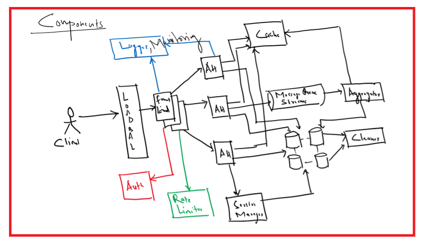
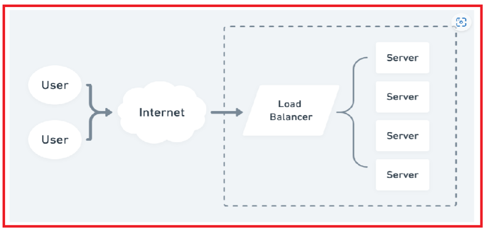

# __Scope Of Work__



### 1. __Load Balancer__



```
* A load balancer is a type of server that distributes incoming web traffic across multiple backend servers. 
* Load balancers are an important component of scalable Internet applications: they allow our application(s) to scale up or down with demand, achieve higher availability, and efficiently utilize server capacity.
```
[Refere Here](https://www.enjoyalgorithms.com/blog/load-balancers-in-system-design)

[Refer Here](https://www.geeksforgeeks.org/load-balancer-system-design-interview-question/)

[Refer here](https://phoenixnap.com/kb/load-balancing)

```
Thought 1. How does a load balancer handle failures?
Thought 2. How does a load balancer distribute the traffic among servers?
```